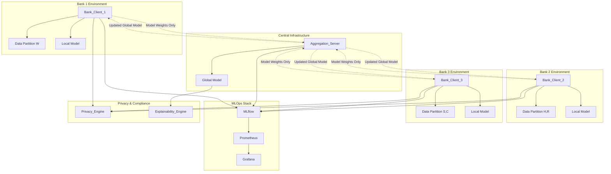
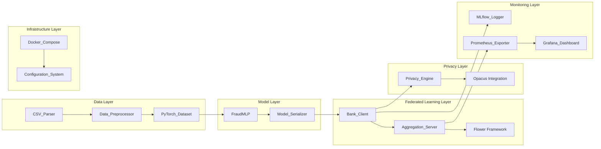

# Design Document: Federated Fraud Intelligence Network

## Overview

The Federated Fraud Intelligence Network is a privacy-preserving distributed machine learning system that enables financial institutions to collaboratively train fraud detection models without sharing sensitive transaction data. The system implements federated learning using the Flower framework, differential privacy through Opacus, and comprehensive MLOps monitoring.

### Key Design Principles

1. **Privacy by Design**: All components implement differential privacy guarantees with configurable epsilon budgets
2. **Data Locality**: Raw transaction data never leaves individual bank premises
3. **Fault Tolerance**: System continues operation despite individual client failures
4. **Regulatory Compliance**: Full audit trails and explainable AI for regulatory requirements
5. **Scalability**: Containerized architecture supports easy addition of new financial institutions

### System Scope

The system processes IEEE-CIS fraud detection dataset partitioned across three simulated banks, implementing 30 rounds of federated learning with FedProx aggregation strategy. Each bank trains locally on their data partition and shares only model weights through a central aggregation server.

## Architecture

### High-Level System Architecture



### Component Architecture



## Components and Interfaces

### Core Components

#### Data_Preprocessor
**Purpose**: Handles IEEE-CIS dataset preprocessing and partitioning across banks

**Key Responsibilities**:
- Merge transaction and identity datasets on TransactionID
- Partition data by ProductCD (W→Bank1, H,R→Bank2, S,C→Bank3)
- Handle missing values and feature encoding
- Implement temporal splitting to prevent data leakage

**Interface**:
```python
class DataPreprocessor:
    def merge_datasets(self, transaction_path: str, identity_path: str) -> pd.DataFrame
    def partition_by_product_cd(self, data: pd.DataFrame) -> Dict[str, pd.DataFrame]
    def handle_missing_values(self, data: pd.DataFrame) -> pd.DataFrame
    def temporal_split(self, data: pd.DataFrame) -> Tuple[pd.DataFrame, pd.DataFrame, pd.DataFrame]
    def encode_categorical_features(self, data: pd.DataFrame) -> pd.DataFrame
```

#### FraudMLP
**Purpose**: Neural network architecture for fraud detection with embedding layers

**Key Responsibilities**:
- Handle mixed categorical and numerical features
- Implement GroupNorm for Opacus compatibility
- Support class imbalance with weighted loss

**Interface**:
```python
class FraudMLP(nn.Module):
    def __init__(self, categorical_dims: Dict[str, int], numerical_features: int, 
                 embedding_dim: int = 50, hidden_dims: List[int] = [256, 128, 64])
    def forward(self, categorical_features: Dict[str, torch.Tensor], 
                numerical_features: torch.Tensor) -> torch.Tensor
    def get_embeddings(self) -> Dict[str, torch.Tensor]
```

#### Bank_Client
**Purpose**: Flower client implementation representing a financial institution

**Key Responsibilities**:
- Implement Flower client interface
- Train local model on bank-specific data partition
- Apply differential privacy during training
- Send only model weights to aggregation server

**Interface**:
```python
class BankClient(fl.client.NumPyClient):
    def get_parameters(self, config: Dict[str, str]) -> List[np.ndarray]
    def fit(self, parameters: List[np.ndarray], config: Dict[str, str]) -> Tuple[List[np.ndarray], int, Dict]
    def evaluate(self, parameters: List[np.ndarray], config: Dict[str, str]) -> Tuple[float, int, Dict]
    def apply_differential_privacy(self, model: nn.Module, dataloader: DataLoader) -> None
```

#### Aggregation_Server
**Purpose**: Central server coordinating federated learning rounds

**Key Responsibilities**:
- Implement FedProx aggregation strategy
- Coordinate 30 FL rounds
- Distribute updated global model to clients
- Handle client failures gracefully

**Interface**:
```python
class AggregationServer:
    def start_federated_learning(self, num_rounds: int = 30) -> None
    def aggregate_weights(self, client_weights: List[List[np.ndarray]]) -> List[np.ndarray]
    def evaluate_global_model(self, test_data: DataLoader) -> Dict[str, float]
    def handle_client_failure(self, client_id: str) -> None
```

#### Privacy_Engine
**Purpose**: Implements differential privacy using Opacus library

**Key Responsibilities**:
- Track privacy budget consumption
- Add calibrated noise to gradients
- Support multiple epsilon values (0.5, 1, 2, 4, 8)
- Generate privacy-utility curves

**Interface**:
```python
class PrivacyEngine:
    def __init__(self, epsilon: float, delta: float = 1e-5)
    def make_private(self, model: nn.Module, optimizer: torch.optim.Optimizer, 
                    dataloader: DataLoader) -> Tuple[nn.Module, torch.optim.Optimizer, DataLoader]
    def get_privacy_spent(self) -> Tuple[float, float]
    def generate_privacy_utility_curve(self, epsilons: List[float]) -> Dict[float, float]
```

#### Explainability_Engine
**Purpose**: Provides SHAP-based model interpretations for regulatory compliance

**Key Responsibilities**:
- Generate feature importance scores
- Provide local explanations for individual predictions
- Export explanations in JSON format for audit trails

**Interface**:
```python
class ExplainabilityEngine:
    def __init__(self, model: nn.Module, background_data: torch.Tensor)
    def explain_prediction(self, input_data: torch.Tensor) -> Dict[str, float]
    def get_global_feature_importance(self, test_data: DataLoader) -> Dict[str, float]
    def export_explanations(self, explanations: Dict, filepath: str) -> None
```

### Supporting Components

#### Monitoring_System
**Purpose**: MLOps infrastructure for experiment tracking and system monitoring

**Components**:
- **MLflow_Logger**: Tracks experiments, metrics, and model artifacts
- **Prometheus_Exporter**: Exposes real-time system metrics
- **Grafana_Dashboard**: Visualizes federated learning progress

#### Configuration_System
**Purpose**: Manages system parameters through YAML configuration

**Key Features**:
- Schema validation for all parameters
- Environment-specific overrides
- Hot-reloading for non-critical parameters

## Data Models

### IEEE-CIS Dataset Schema

```python
@dataclass
class TransactionRecord:
    TransactionID: int
    TransactionDT: float
    TransactionAmt: float
    ProductCD: str  # W, H, R, S, C
    card1: Optional[int]
    card2: Optional[float]
    card3: Optional[float]
    card4: Optional[str]
    card5: Optional[float]
    card6: Optional[str]
    addr1: Optional[float]
    addr2: Optional[float]
    dist1: Optional[float]
    dist2: Optional[float]
    P_emaildomain: Optional[str]
    R_emaildomain: Optional[str]
    C1: Optional[float]
    # ... additional C, D, M, V features
    isFraud: int  # Target variable
```

### Federated Learning Models

```python
@dataclass
class FLRoundMetrics:
    round_number: int
    client_id: str
    local_loss: float
    local_auprc: float
    local_auroc: float
    privacy_spent: Tuple[float, float]
    training_time: float
    num_samples: int

@dataclass
class GlobalModelMetrics:
    round_number: int
    global_loss: float
    global_auprc: float
    global_auroc: float
    convergence_metric: float
    participating_clients: List[str]
```

### Configuration Schema

```yaml
# config.yaml
federated_learning:
  num_rounds: 30
  min_fit_clients: 2
  min_evaluate_clients: 2
  min_available_clients: 3
  strategy: "FedProx"
  proximal_mu: 0.01

model:
  embedding_dim: 50
  hidden_dims: [256, 128, 64]
  dropout_rate: 0.3
  learning_rate: 0.001
  batch_size: 1024

privacy:
  epsilon: 1.0
  delta: 1e-5
  max_grad_norm: 1.0
  noise_multiplier: 1.1

data:
  train_split: 0.8
  val_split: 0.1
  test_split: 0.1
  missing_threshold: 0.5

monitoring:
  mlflow_tracking_uri: "http://localhost:5000"
  prometheus_port: 8000
  grafana_port: 3000
  log_level: "INFO"
```
## Correctness Properties

*A property is a characteristic or behavior that should hold true across all valid executions of a system-essentially, a formal statement about what the system should do. Properties serve as the bridge between human-readable specifications and machine-verifiable correctness guarantees.*

After analyzing the acceptance criteria, I identified several logically redundant properties that can be consolidated:

**Property Reflection:**
- Properties about data partitioning (1.2) and temporal splitting (1.5, 1.7) can be combined into comprehensive data integrity properties
- Model architecture properties (2.1, 2.2, 2.4) can be consolidated into a single architecture validation property
- Federated learning communication properties (3.5, 3.8) both ensure data privacy and can be combined
- Configuration validation properties (12.2, 12.5) both deal with parameter validation and can be unified
- Monitoring properties (7.1, 7.2) both deal with metric logging and can be combined

### Property 1: Data Processing Round-Trip Integrity

*For any* valid IEEE-CIS dataset, processing through merge, partition, missing value handling, and temporal split should preserve all valid transactions and maintain referential integrity between transaction and identity records.

**Validates: Requirements 1.1, 1.4, 1.7**

### Property 2: Data Partitioning Correctness

*For any* merged IEEE-CIS dataset, partitioning by ProductCD should result in Bank1 receiving all W transactions, Bank2 receiving all H and R transactions, Bank3 receiving all S and C transactions, with no transaction appearing in multiple partitions.

**Validates: Requirements 1.2**

### Property 3: Missing Value Handling Completeness

*For any* dataset after preprocessing, no null values should remain and columns with >50% missing values should be removed while preserving data type consistency.

**Validates: Requirements 1.3, 1.4**

### Property 4: Temporal Data Integrity

*For any* temporally split dataset, the maximum timestamp in training data should be less than the minimum timestamp in validation data, which should be less than the minimum timestamp in test data, maintaining 80/10/10 split ratios.

**Validates: Requirements 1.5, 1.7**

### Property 5: Model Architecture Compliance

*For any* FraudMLP model instance, it should contain embedding layers for categorical features, GroupNorm layers (not BatchNorm), BCELoss with pos_weight, and output probabilities in [0,1] range for all inputs.

**Validates: Requirements 2.1, 2.2, 2.3, 2.4, 2.7**

### Property 6: Dataset Configuration Consistency

*For any* PyTorch dataset configuration, it should use WeightedRandomSampler for class imbalance and drop_last=True for Opacus compatibility.

**Validates: Requirements 2.5, 2.6**

### Property 7: Federated Learning Protocol Adherence

*For any* federated learning round, each Bank_Client should train locally, send only model weights (never raw data) to the Aggregation_Server, and receive updated global model parameters.

**Validates: Requirements 3.1, 3.4, 3.5, 3.7, 3.8**

### Property 8: FedProx Aggregation Correctness

*For any* set of client model weights, the Aggregation_Server should aggregate them using FedProx strategy with proximal_mu=0.01 and execute exactly 30 FL rounds.

**Validates: Requirements 3.2, 3.3, 3.6**

### Property 9: Privacy Budget Conservation

*For any* Privacy_Engine configuration with epsilon budget, the cumulative privacy spent across all FL rounds should never exceed the initial epsilon value, and training should halt when budget is exhausted.

**Validates: Requirements 4.3, 4.4**

### Property 10: Differential Privacy Noise Addition

*For any* model update during federated learning, the Privacy_Engine should add calibrated noise to gradients and provide formal (epsilon, delta) differential privacy guarantees.

**Validates: Requirements 4.1, 4.6, 4.7**

### Property 11: Privacy-Utility Analysis

*For any* set of epsilon values [0.5, 1, 2, 4, 8], the Privacy_Engine should generate privacy-utility curves showing AUPRC performance versus privacy budget consumption.

**Validates: Requirements 4.2, 4.5**

### Property 12: SHAP Explainability Completeness

*For any* fraud prediction made by the Global_Model, the Explainability_Engine should provide SHAP-based local explanations with top 10 contributing features and feature names matching original dataset columns.

**Validates: Requirements 5.1, 5.2, 5.3, 5.5, 5.7**

### Property 13: Explanation Export Integrity

*For any* generated SHAP explanations, they should be exportable in valid JSON format and include both local and global feature importance rankings.

**Validates: Requirements 5.4, 5.6**

### Property 14: Container Orchestration Architecture

*For any* Docker deployment, the system should run exactly 1 Aggregation_Server container and 3 Bank_Client containers with network isolation between bank containers and persistent volume mounts.

**Validates: Requirements 6.1, 6.2, 6.3, 6.4, 6.5**

### Property 15: Container Lifecycle Management

*For any* container in the federated system, it should support graceful shutdown/restart and automatically initialize the federated learning network on startup.

**Validates: Requirements 6.6, 6.7**

### Property 16: Comprehensive Metrics Logging

*For any* FL round execution, the MLflow_Logger should track AUPRC, AUROC, loss, privacy budget, model artifacts, and hyperparameters with fixed random seeds for reproducibility.

**Validates: Requirements 7.1, 7.2, 7.5, 7.7**

### Property 17: Real-time Monitoring Integration

*For any* federated learning execution, Prometheus should expose system metrics including round duration and convergence, Grafana should visualize progress, and alerts should trigger on failures or performance degradation.

**Validates: Requirements 7.3, 7.4, 7.6**

### Property 18: Performance Evaluation Completeness

*For any* trained Global_Model, the Evaluation_System should compute AUPRC and AUROC with confidence intervals on both individual bank test sets and combined test data, tracking convergence across FL rounds.

**Validates: Requirements 8.1, 8.2, 8.3, 8.4, 8.5, 8.7**

### Property 19: Baseline Performance Comparison

*For any* federated learning experiment, the system should compare federated model performance against a centralized baseline trained on combined data.

**Validates: Requirements 8.6**

### Property 20: Data Serialization Round-Trip

*For any* valid DataFrame, CSV file, or PyTorch model, serializing then deserializing should produce an equivalent object, and CSV parsing should handle both valid and invalid data appropriately.

**Validates: Requirements 9.1, 9.2, 9.3, 9.4, 9.5**

### Property 21: Configuration Management Round-Trip

*For any* valid configuration object, parsing YAML then pretty-printing should produce equivalent YAML, and the Configuration_Parser should handle both valid and invalid YAML appropriately.

**Validates: Requirements 9.6, 9.7**

### Property 22: System Fault Tolerance

*For any* client disconnection or network failure during federated learning, the system should continue operation with remaining clients, implement exponential backoff retry, and maintain detailed error logs.

**Validates: Requirements 11.1, 11.2, 11.3**

### Property 23: Adaptive Resource Management

*For any* resource constraint (memory limits, corrupted data), the system should adapt by reducing batch size, quarantining corrupted records, and implementing checkpointing for recovery.

**Validates: Requirements 11.4, 11.5, 11.7**

### Property 24: Security Validation

*For any* model weights received during aggregation, the system should validate them against expected schemas to prevent poisoning attacks.

**Validates: Requirements 11.6**

### Property 25: Configuration System Robustness

*For any* YAML configuration with valid or invalid parameters, the Configuration_System should validate against schemas, provide default values for optional parameters, support environment overrides, and return specific validation errors for invalid configurations.

**Validates: Requirements 12.1, 12.2, 12.3, 12.4, 12.5**

### Property 26: Privacy Budget Enforcement per Bank

*For any* multi-bank configuration with different privacy budgets, the Configuration_System should enforce epsilon constraints individually per bank and support hot-reloading of non-critical parameters.

**Validates: Requirements 12.6, 12.7**

## Error Handling

### Data Processing Errors

**Missing Data Handling**:
- Columns with >50% missing values are automatically dropped
- Remaining null values are imputed using mode for categorical and median for numerical features
- Data type inconsistencies are logged and corrected where possible

**Corrupted Data Recovery**:
- Malformed CSV records are quarantined in separate error logs
- Processing continues with valid records
- Detailed error reports are generated for data quality assessment

### Federated Learning Errors

**Client Failure Handling**:
- Server continues aggregation with minimum 2 out of 3 clients
- Disconnected clients implement exponential backoff retry (base=2, max_delay=60s)
- Failed FL rounds are logged and skipped, with automatic retry on next round

**Model Validation**:
- Model weights are validated for expected tensor shapes and value ranges
- Poisoning attack detection through statistical outlier analysis
- Corrupted model updates are rejected with detailed error logging

### Privacy Engine Errors

**Budget Exhaustion**:
- Training automatically halts when epsilon budget is consumed
- Clear warnings are provided before budget exhaustion
- Privacy accounting is logged at each FL round

**Opacus Integration Errors**:
- Model compatibility is validated before privacy engine attachment
- Gradient clipping failures are handled with adaptive norm adjustment
- Noise addition failures trigger fallback to higher noise levels

### Infrastructure Errors

**Container Failures**:
- Individual container failures don't affect other components
- Automatic restart policies with exponential backoff
- Health checks ensure service availability before FL round initiation

**Resource Constraints**:
- Memory pressure triggers automatic batch size reduction
- Disk space monitoring with cleanup of old model checkpoints
- CPU throttling detection with adaptive training schedule adjustment

## Testing Strategy

### Dual Testing Approach

The system employs both unit testing and property-based testing for comprehensive coverage:

**Unit Tests**: Focus on specific examples, edge cases, and integration points
- Individual component functionality verification
- Error condition handling
- Integration between federated learning components
- Specific data preprocessing scenarios

**Property Tests**: Verify universal properties across all inputs using Hypothesis library
- Data integrity properties with randomized datasets
- Model behavior properties with generated inputs
- Federated learning protocol adherence across random configurations
- Privacy guarantee verification with various epsilon values

### Property-Based Testing Configuration

**Library**: Hypothesis for Python property-based testing
**Test Configuration**:
- Minimum 100 iterations per property test
- Each test tagged with format: **Feature: federated-fraud-detection, Property {number}: {property_text}**
- Randomized data generation for IEEE-CIS dataset structure
- Model weight generation for federated learning scenarios

**Key Property Test Categories**:

1. **Data Processing Properties** (Properties 1-4):
   - Generate random IEEE-CIS-like datasets
   - Test merge, partition, and temporal split operations
   - Verify data integrity and consistency

2. **Model Architecture Properties** (Properties 5-6):
   - Generate random model configurations
   - Test embedding layer functionality and output ranges
   - Verify Opacus compatibility

3. **Federated Learning Properties** (Properties 7-8):
   - Simulate FL rounds with random client configurations
   - Test weight aggregation and distribution
   - Verify protocol adherence

4. **Privacy Properties** (Properties 9-11):
   - Test privacy budget tracking with various epsilon values
   - Verify noise addition and differential privacy guarantees
   - Generate privacy-utility curves

5. **System Integration Properties** (Properties 12-26):
   - Test end-to-end workflows with randomized configurations
   - Verify error handling and fault tolerance
   - Test serialization and configuration management

### Unit Testing Balance

**Unit Test Focus Areas**:
- Specific IEEE-CIS dataset preprocessing examples
- Known fraud detection scenarios and edge cases
- Container orchestration integration points
- MLOps pipeline integration with MLflow, Prometheus, Grafana
- Error conditions and recovery scenarios

**Property Test Coverage**:
- Universal data processing correctness
- Model behavior across all input ranges
- Federated learning protocol compliance
- Privacy guarantee verification
- System resilience under various failure modes

**Testing Infrastructure**:
- GitHub Actions CI/CD pipeline
- Automated testing on pull requests
- Integration testing with Docker containers
- Performance testing with synthetic datasets
- Security testing for privacy guarantees

The combination ensures that specific known scenarios are thoroughly tested while property-based tests provide comprehensive coverage across the vast input space of federated learning configurations.